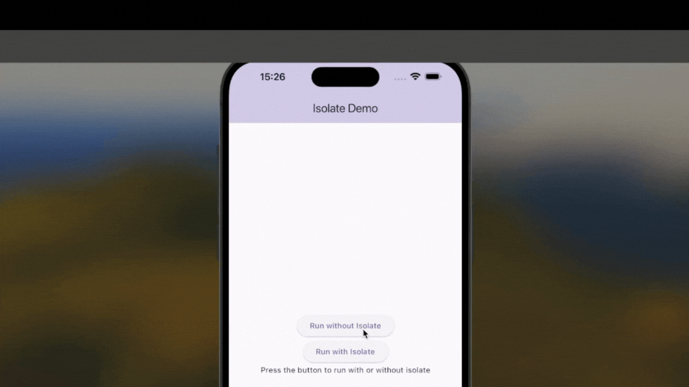

# isolate_tutorial

Flutter'da Isolate kullanımı, Dart dilinin bir tür çok iş parçacıklı (multithreading) programlamayı destekleme şeklidir.
Bu repo Isolate'lerin işlevini anlamak için temel bir uygulama içerir.

## Başlangıç

1. **Kurulum**
   
   Projeyi klonlayın ve gerekli paketleri yükleyin:
   ```bash
   git clone https://github.com/melikeyogurtcu/Flutter-Isolates.git 
2. **Gerekli paketleri yükleyin:**

    ```bash
   flutter pub get

## Isolate'leri Test Etme

Isolate ile çalıştırdığımız buton rahatça çalışabilirken Isolate olmadan çalışan butonun donarak
çalıştığını gözlemleyebiliriz.


